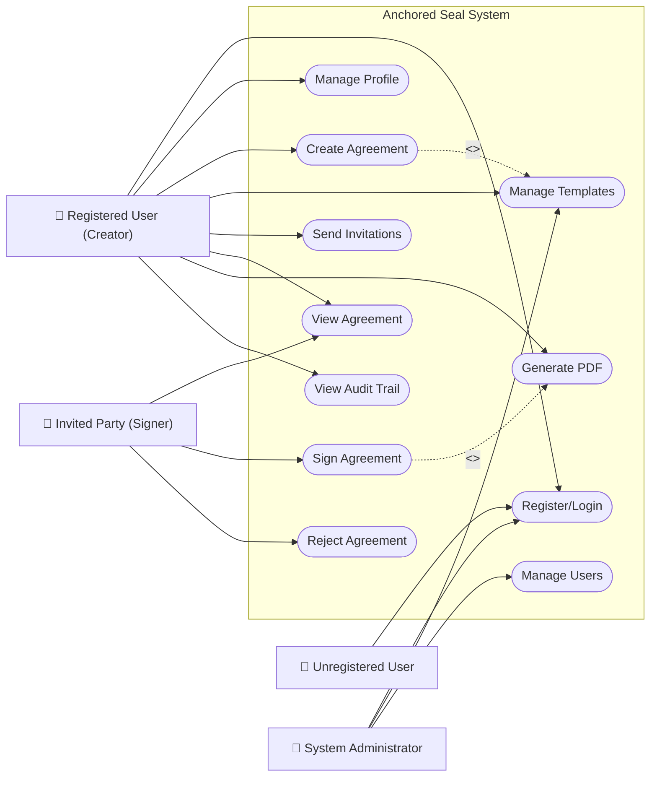
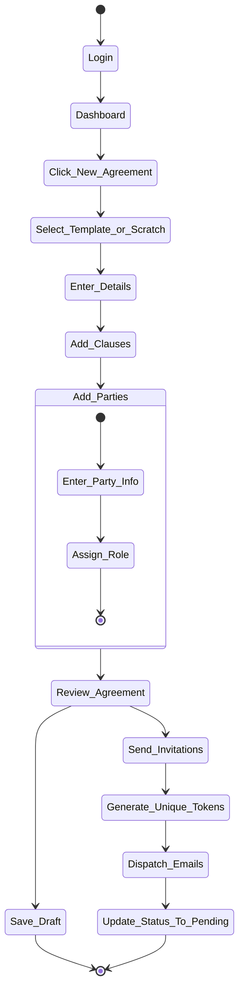
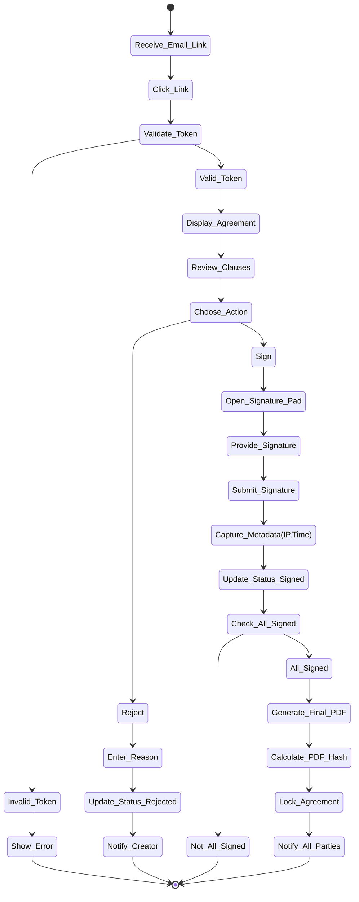
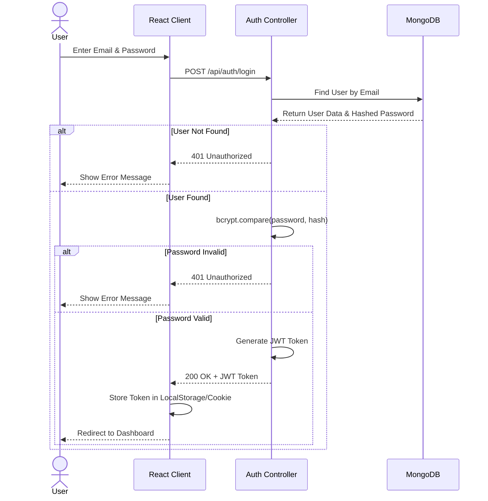
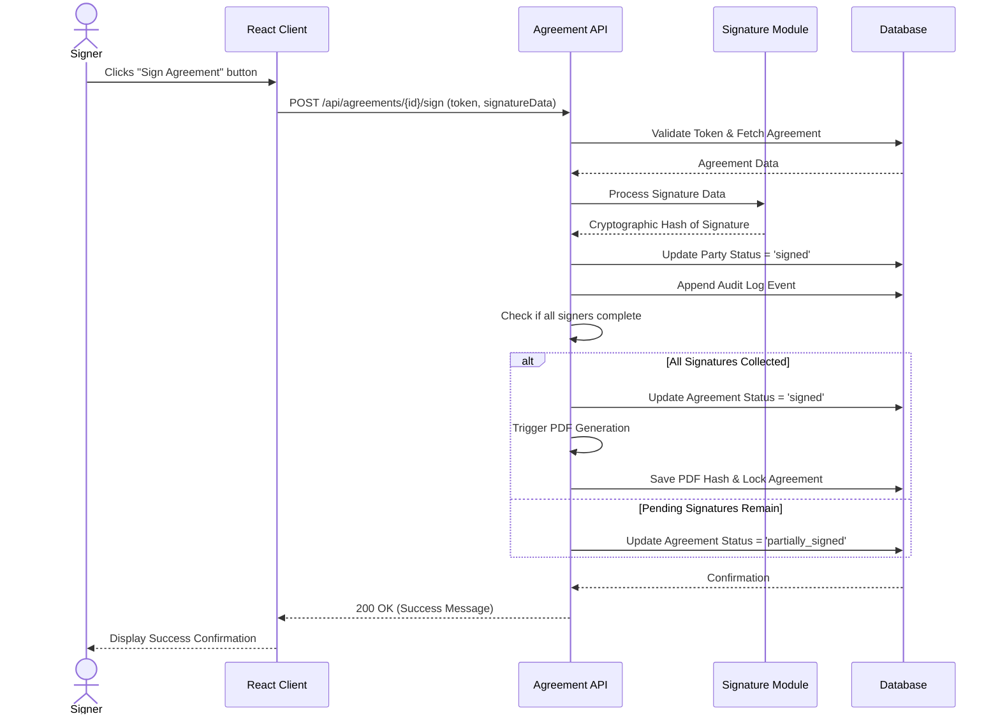
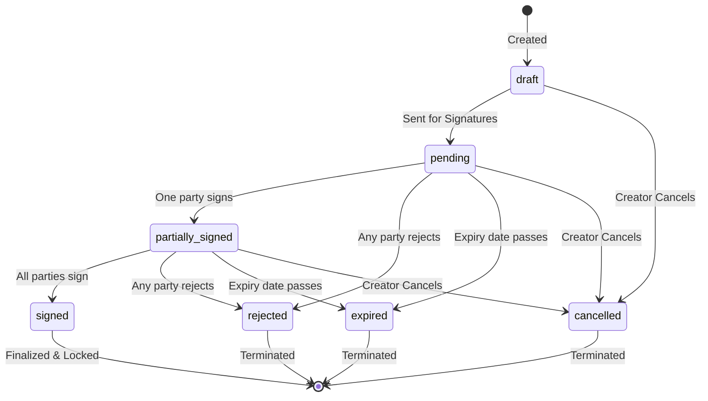
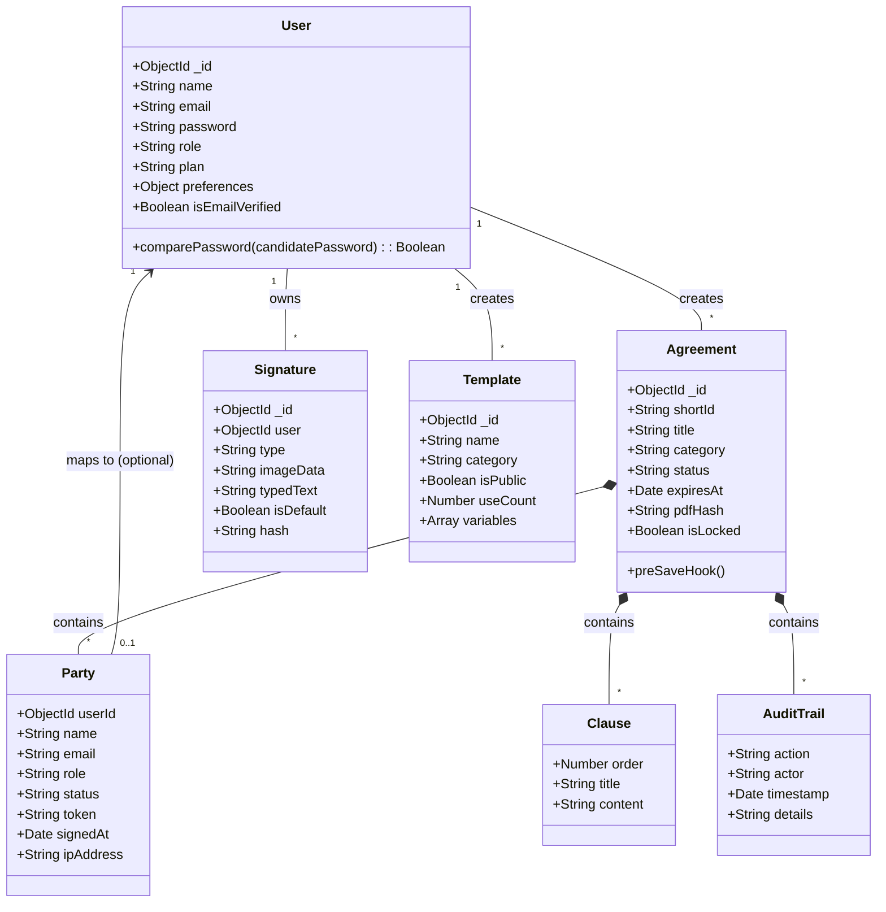
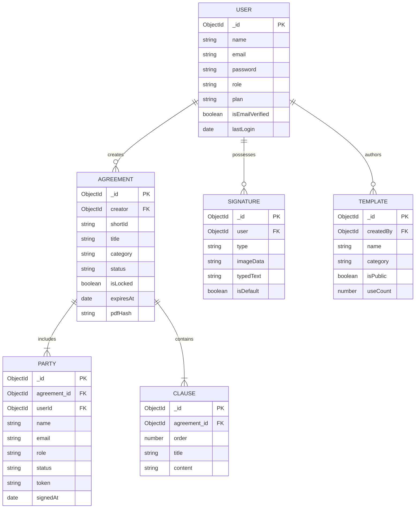
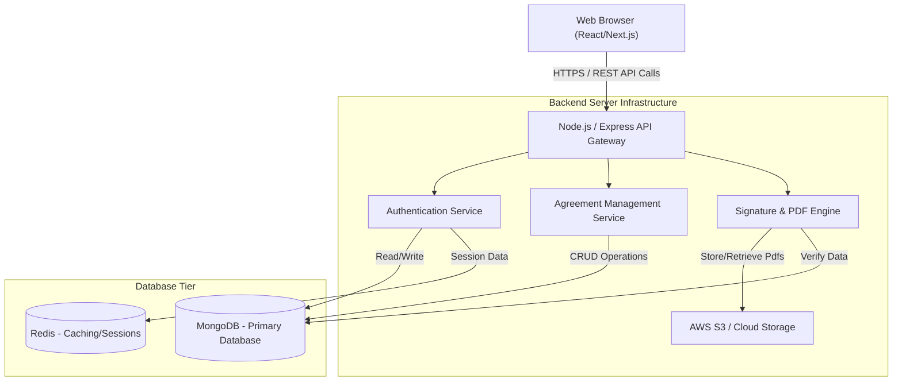
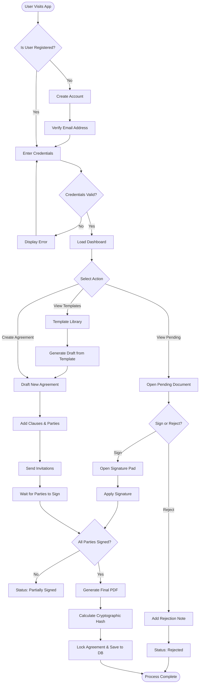

# CHAPTER THREE — METHODOLOGY

## 3.1 Introduction
This chapter presents the methodology adopted for the analysis, design, and development of the Anchored Seal platform—an advanced electronic signature and agreement management system. The primary objective of this chapter is to outline the structured approach used in transitioning from the initial problem definition to a fully functional, secure, and user-friendly software solution. It discusses the adopted software development methodology, detailing its phases and application to the Anchored Seal project. Furthermore, this chapter provides an exhaustive system analysis, specifying the users, functional, and non-functional requirements. It then delves into the system design, presenting various Unified Modeling Language (UML) diagrams (including use case, activity, sequence, state, class, and entity-relationship diagrams) that model the system's architecture, flow, and database schema. Additionally, the user interface and security designs are thoroughly documented to ensure the system is both intuitive and highly secure, complying with standard electronic signature regulations and best practices.

## 3.2 Software Development Methodology
The software development methodology is a framework used to structure, plan, and control the process of developing an information system. Choosing the right methodology is critical to the success of any project, as it dictates how tasks are divided, how requirements are gathered, and how the final product is delivered and maintained.

### 3.2.1 Adopted Software Development Methodology
For the development of Anchored Seal, the **Agile Software Development Methodology**, specifically the **Scrum framework**, was adopted. Agile is an iterative and incremental approach to software development that emphasizes flexibility, continuous improvement, and rapid delivery of functional software components. Unlike traditional predictive methodologies like the Waterfall model, Agile allows for requirements and solutions to evolve through collaborative effort between cross-functional teams and end-users.

The Scrum framework was chosen because of its structured yet flexible nature, dividing the development lifecycle into short, time-boxed iterations called "Sprints," typically lasting two to four weeks. This approach enables the development team to focus on delivering a minimum viable product (MVP) quickly and then iteratively adding features, such as the advanced agreement management and PDF integrity modules, based on continuous feedback and evolving business requirements.

### 3.2.2 Application of the Methodology to Anchored Seal
The application of the Agile/Scrum methodology to the Anchored Seal project was executed through the following distinct phases:

1. **Product Backlog Creation:** The project commenced with a comprehensive requirements gathering phase. The product owner compiled a prioritized list of all desired features, functionalities, and enhancements required for the system. This formed the Product Backlog, which included modules like User Authentication, Agreement Creation, Electronic Signatures, and Audit Trails.
2. **Sprint Planning:** Before each Sprint, the development team selected high-priority items from the Product Backlog to form the Sprint Backlog. For example, Sprint 1 focused on the foundational database schema and User Authentication module, while Sprint 2 tackled the Agreement Creation and Template Management modules.
3. **Daily Scrum Meetings:** The development team engaged in brief, daily stand-up meetings to synchronize activities, discuss progress, and identify any impediments or bottlenecks that could hinder the Sprint goal.
4. **Iterative Development and Testing:** During the Sprint, the team designed, coded, and tested the selected features. Test-Driven Development (TDD) principles were applied where feasible, ensuring that each module, particularly the sensitive Electronic Signature and PDF Generation components, was robust and secure.
5. **Sprint Review and Retrospective:** At the end of each Sprint, a functional increment of the Anchored Seal platform was demonstrated to stakeholders. Feedback was collected and incorporated into the Product Backlog for future iterations. A retrospective meeting was also held to evaluate the team's processes and identify areas for improvement in subsequent Sprints.

## 3.3 System Analysis
System analysis is the process of studying the existing business processes, identifying the core problems, and specifying the detailed requirements that the new system must fulfill. This phase ensures that the proposed Anchored Seal platform aligns perfectly with the needs of its intended users.

### 3.3.1 System Users/Actors
The Anchored Seal platform is designed to cater to various types of users, each with distinct roles and access privileges. The primary actors interacting with the system include:

1. **Unregistered User (Guest):** Individuals who have not yet created an account. They can access the landing page, view public templates, and sign up for an account.
2. **Registered User (Creator):** An authenticated user who can create agreements, utilize templates, invite other parties to sign, manage their signature profile, and track the status of their documents via the dashboard.
3. **Signer/Witness (Invited Party):** An individual (who may or may not be registered) who receives an invitation to review, sign, or witness an agreement. They access a secure link to perform their designated action.
4. **Viewer:** A party invited strictly to read the agreement without signing privileges.
5. **System Administrator:** A privileged user responsible for managing user accounts, monitoring system activity, configuring platform settings, managing premium templates, and overseeing system security and audit logs.

### 3.3.2 Functional Requirements
Functional requirements define the specific behaviors, functions, and operations that the system must perform. For Anchored Seal, these requirements form the core of the application's capabilities, ensuring that users can seamlessly manage the entire lifecycle of an electronic agreement.

### 3.3.3 Detailed Functional Modules
The functional requirements are categorized into distinct modules, each responsible for a specific aspect of the system's operation.

#### 3.3.3.1 User Authentication and Management Module
- The system must allow users to register using their name, email, and password, or via third-party OAuth providers (e.g., Google).
- The system must verify the user's email address upon registration using a secure token.
- The system must provide secure login mechanisms utilizing JWT (JSON Web Tokens) for session management.
- The system must allow users to manage their profiles, update personal information, change passwords, and configure preferences (e.g., dark mode, language, notifications).
- The system must support password recovery via secure, time-limited reset links sent to the registered email.

#### 3.3.3.2 Agreement Management Module
- The system must allow authenticated users to create new agreements from scratch by defining the title, category, and descriptive details.
- The system must enable users to add, edit, reorder, and delete clauses within an agreement using a rich text editor.
- The system must provide a dashboard displaying a paginated list of all agreements, filterable by status (draft, pending, partially_signed, signed, rejected, expired, cancelled).
- The system must allow the creator to lock an agreement to prevent further edits once it has been sent for signatures.
- The system must support soft deletion of agreements, allowing recovery if necessary.

#### 3.3.3.3 Agreement Template Module
- The system must allow administrators and authorized users to create and publish reusable templates across various categories (e.g., NDA, Freelance Contract).
- The system must support variables within templates (e.g., `[Client Name]`, `[Date]`) that dynamically populate when a new agreement is instantiated from the template.
- The system must track the usage count of each template and distinguish between free, public, and premium templates.

#### 3.3.3.4 Party and Invitation Management Module
- The system must allow the creator to add multiple parties to an agreement, assigning specific roles (creator, signer, witness, viewer) to each.
- The system must generate unique, secure, and time-bound tokens for each invited party to access the document without requiring an account.
- The system must dispatch automated email notifications with the secure link when an agreement is ready for review or signing.
- The system must allow parties to reject an agreement and append a rejection note explaining their reasoning.

#### 3.3.3.5 Electronic Signature Module
- The system must provide users with a dedicated signature pad to create their signatures.
- The system must support three distinct signature creation methods: drawing (via mouse or touch), typing (selecting from stylized fonts), and uploading an image.
- The system must allow users to save their preferred signature as the default for future use.
- The system must securely capture and store the signature data (base64 image data or typed text) and generate a cryptographic hash of the signature.

#### 3.3.3.6 Agreement Signing and Verification Module
- The system must present the invited party with a clear, immutable view of the agreement clauses.
- The system must provide a secure interface for applying the signature to the document.
- The system must automatically update the status of the individual party (to 'viewed', 'accepted', 'rejected', or 'signed') and the overall agreement status based on the state machine logic.
- The system must capture the IP address, user agent, and precise timestamp of the signature event to ensure non-repudiation.

#### 3.3.3.7 Audit Trail and Activity Module
- The system must automatically record every significant action performed on an agreement (e.g., created, edited, sent, viewed, signed, rejected).
- The system must store the actor's identifier, the specific action taken, a timestamp, and contextual details for each audit event.
- The system must provide a chronological, unalterable view of the audit trail attached to each agreement for legal compliance and verification.

#### 3.3.3.8 PDF Generation and Document Integrity Module
- The system must generate a finalized PDF document once all required parties have signed the agreement.
- The generated PDF must include the agreement content, the appended signatures, and a detailed summary of the audit trail.
- The system must calculate a cryptographic hash (e.g., SHA-256) of the finalized PDF and store it securely in the database to verify document integrity in the future.

#### 3.3.3.9 Comments and Collaboration Module
- The system must allow parties to leave comments and collaborate directly on the agreement draft before it is finalized or locked.
- The system must record the user, the comment text, and the timestamp, displaying the discussion thread alongside the agreement.

#### 3.3.3.10 Dashboard and Activity Module
- The system must provide a centralized dashboard presenting high-level metrics, such as the total number of agreements, pending signatures, and completed documents.
- The system must display a timeline or list of recent activities relevant to the user, providing quick access to actionable items.

#### 3.3.3.11 Administration Module
- The system must provide a secure administrative panel restricted to users with 'admin' or 'superadmin' roles.
- The admin panel must allow the management of user accounts (banning/unbanning), monitoring of system health, and management of global templates and categories.

### 3.3.4 Non-Functional Requirements
Non-functional requirements describe the quality attributes, performance constraints, and systemic characteristics that govern how the system operates, rather than what it does.

1. **Security:** The system must enforce strict data protection. Passwords must be hashed using bcrypt (cost factor 12). API endpoints must be protected using JWT authentication. Sensitive actions must be protected against Cross-Site Request Forgery (CSRF) and Cross-Site Scripting (XSS).
2. **Performance:** The platform must be highly responsive. Dashboard data and agreement lists must load within 2 seconds under normal network conditions. The PDF generation process, being resource-intensive, should ideally complete within 5 seconds and may utilize background processing.
3. **Scalability:** The architecture must be capable of scaling horizontally to accommodate a growing user base and increasing document storage requirements without a degradation in performance.
4. **Availability:** The system should target an uptime of 99.9%, employing robust deployment strategies, database replication, and automated backups to prevent data loss.
5. **Usability:** The user interface must be intuitive, modern, and accessible. It must adhere to responsive design principles, ensuring seamless operation across desktop, tablet, and mobile devices.
6. **Integrity and Non-Repudiation:** The system must guarantee that signed documents cannot be altered undetected. This relies heavily on the cryptographic hashing of PDFs and strict audit trails.

## 3.4 System Design
System design is the process of defining the architecture, components, modules, interfaces, and data for a system to satisfy specified requirements. This section utilizes Unified Modeling Language (UML) diagrams to provide a visual and structural blueprint of the Anchored Seal platform.

### 3.4.1 Use Case Diagram
The Use Case Diagram illustrates the high-level interactions between the external actors and the core functionalities (use cases) provided by the system. It defines the system's boundary and clarifies who can do what.

### 3.4.2 Activity Diagrams
Activity diagrams describe the dynamic aspects of the system, modeling the flow of control from one activity to another. They are particularly useful for illustrating complex business logic and step-by-step processes.

#### 3.4.2.1 Agreement Creation and Sending Activity
This diagram models the flow when a creator initiates a new agreement and sends it to other parties.

#### 3.4.2.2 Document Signing Process Activity
This diagram models the flow when an invited signer accesses and signs the document.

### 3.4.3 Sequence Diagrams
Sequence diagrams depict how objects interact with each other over time, detailing the exact sequence of messages exchanged to execute a specific functionality.

#### 3.4.3.1 Login Sequence

#### 3.4.3.2 Document Signing Sequence

### 3.4.4 State Diagram
The State Diagram illustrates the lifecycle of a specific entity within the system, showing the various states it can exist in and the transitions between them. The most complex entity in Anchored Seal is the `Agreement`.

#### 3.4.4.1 Agreement State Machine

### 3.4.5 Class Diagram
The Class Diagram provides a static view of the system's structure, defining the main classes, their attributes, methods, and the relationships (associations, inheritances) between them. This closely aligns with the backend object-oriented models.

### 3.4.6 Entity Relationship Diagram
The Entity Relationship Diagram (ERD) focuses purely on the database schema, illustrating the tables (or collections in MongoDB), their fields, and the logical relationships (foreign keys/references) connecting them.

### 3.4.7 System Architecture Diagram
This diagram depicts the high-level physical and logical architecture of the application, illustrating how the frontend, backend server, database, and external services interact. Anchored Seal employs a modern, decoupled client-server architecture.

### 3.4.8 System Flowchart
The System Flowchart provides a holistic, algorithm-like view of the entire system's operational flow from the user's perspective, starting from entry into the application.

## 3.5 Database Design
The database design is a critical component that ensures data integrity, fast retrieval, and scalability. Anchored Seal utilizes **MongoDB**, a NoSQL document database, which provides flexibility in handling complex, hierarchical data structures like documents containing embedded clauses and parties.

### 3.5.1 Database Model
The application relies on Mongoose as an Object Data Modeling (ODM) library to enforce schemas, validate data, and define relationships within the MongoDB environment. The core models are meticulously designed to capture all necessary business logic and state.

### 3.5.2 User Collection
The `User` collection stores all credential and profile information for registered entities.
- **Fields:** `_id`, `name`, `email` (unique, indexed), `password` (hashed, select: false), `role` (enum: user, admin, superadmin), `plan`, `preferences`, `isEmailVerified`, `timestamps`.
- **Logic:** Includes pre-save hooks to automatically hash passwords using bcrypt before persistence.

### 3.5.3 Agreement Collection
The `Agreement` collection is the central hub of the system. It is a highly structured document that embeds arrays for parties, clauses, comments, and the audit trail.
- **Fields:** `_id`, `shortId` (unique), `title`, `category`, `status` (enum state machine), `creator` (Ref: User), `parties` (Embedded Array), `clauses` (Embedded Array), `auditTrail` (Embedded Array), `isLocked`, `pdfHash`, `timestamps`.
- **Logic:** Employs a complex pre-save state machine hook. Whenever the document is saved, the hook evaluates the statuses of all embedded `parties`. If any party has rejected, the agreement status becomes 'rejected'. If all signers have signed, it transitions to 'signed' and logs a `completedAt` timestamp.

### 3.5.4 Signature Collection
The `Signature` collection stores the reusable graphical representations of user signatures.
- **Fields:** `_id`, `user` (Ref: User), `type` (enum: drawn, typed, uploaded), `imageData` (Base64 string), `typedText`, `isDefault`, `hash`.
- **Logic:** Enforces a business rule via a pre-save hook ensuring that a user can only have one `isDefault: true` signature at a time, automatically toggling others to false when a new default is set.

### 3.5.5 Template Collection
The `Template` collection stores boilerplate document structures that can be instantiated into new Agreements.
- **Fields:** `_id`, `name`, `category`, `isPublic`, `useCount`, `clauses` (Embedded Array), `variables` (Embedded Array for dynamic insertion), `createdBy` (Ref: User).

### 3.5.6 Database Relationships
While MongoDB is non-relational, logical relationships are established using `ObjectId` references. The `Agreement` model heavily references the `User` model for the `creator` field. Embedded documents (like `parties` and `clauses`) are used to ensure that fetching a single agreement retrieves all its critical contextual data in a single, highly performant database query, avoiding expensive joins.

## 3.6 User Interface Design
The User Interface (UI) design focuses on delivering a sleek, modern, and highly intuitive user experience. The aesthetic principles prioritize trust, clarity, and ease of use, leveraging a dark mode theme with glassmorphism elements, clean typography, and vibrant interactive highlights.

*(Note: The following sections present high-fidelity mockups generated during the design phase.)*

### 3.6.1 Landing Page
The landing page serves as the entry point, designed to immediately establish credibility and convey the platform's value proposition. It features a strong headline, clear calls-to-action (CTAs), and trust indicators such as compliance badges (GDPR, ISO).

*Figure 3.1: Anchored Seal Landing Page featuring a secure, modern aesthetic.*

### 3.6.2 Authentication Interface
The login and registration screens prioritize simplicity, reducing friction during the onboarding process. They provide clear inputs with real-time validation and support for third-party SSO (Single Sign-On).

### 3.6.3 Dashboard
The Dashboard is the control center for registered users. It presents actionable intelligence, including aggregate statistics (total agreements, pending signatures) and a meticulously organized list of recent agreements, allowing users to quickly gauge their document workflow at a glance.

*Figure 3.2: User Dashboard displaying metrics and recent agreement status.*

### 3.6.4 Agreement Management Interface
This interface allows users to filter, search, and manage their entire repository of agreements. It features status badges and quick-action menus for viewing, downloading, or cancelling documents.

### 3.6.5 Agreement Creation Interface
Creating an agreement is a guided, multi-step process. The interface is designed to prevent cognitive overload by dividing the task into logical sections: defining metadata, adding parties/roles, and editing clauses via a rich text interface.

*Figure 3.3: Agreement Creation Form with structured inputs and a rich text editor.*

### 3.6.6 Template Interface
The template library allows users to browse pre-defined document structures, preview their contents, and instantly instantiate a new draft.

### 3.6.7 Signing Interface
The most critical UI component is the signing interface. It provides a distraction-free environment where the invited party can review the document. When initiated, a prominent, high-contrast modal appears, offering intuitive options to draw, type, or upload a signature.

*Figure 3.4: Templates interface showing predefined document structures.*

### 3.6.8 Activity Interface
A dedicated view displaying the chronological audit trail for a specific document, essential for compliance and tracking exactly who did what, and when.

### 3.6.9 Profile Interface
Allows users to manage their default signatures, update personal details, and configure platform preferences.

## 3.7 Security Design
Given the legal and sensitive nature of electronic signatures, security is a paramount concern woven into the fabric of the system architecture.

### 3.7.1 Authentication
The platform enforces strong authentication. Passwords must meet complexity requirements. OAuth 2.0 integration is provided for secure delegation of authentication to trusted providers.

### 3.7.2 Authorization
A Role-Based Access Control (RBAC) system dictates what resources a user can access. For example, a user can only view agreements they created or were explicitly invited to as a party. Admin routes are strictly protected by middleware checking the user's role claim.

### 3.7.3 Password Security
Plaintext passwords are never stored. The system utilizes the bcrypt hashing algorithm with a salt round of 12, providing strong resistance against brute-force and rainbow table attacks.

### 3.7.4 JWT Security
Session management relies on JSON Web Tokens (JWT). Tokens are signed using a strong, secret environment variable. For enhanced security, tokens are transmitted via secure, HttpOnly cookies to prevent extraction via Cross-Site Scripting (XSS) attacks.

### 3.7.5 Signing Token Security
When a party is invited to sign, a cryptographically secure, universally unique identifier (UUID) is generated as their access token. This token acts as a bearer token for that specific document and is transmitted via email. It is decoupled from the main user authentication, allowing non-registered users to participate securely.

### 3.7.6 Audit Trail
The system implements a strict, append-only audit trail within the agreement model. Every critical state change (creation, viewing, signing) automatically appends a record detailing the actor, action, timestamp, and IP address. This data cannot be altered via the standard application interface, ensuring non-repudiation.

### 3.7.7 PDF Hashing and Integrity
To guarantee the integrity of the finalized document, the system calculates a cryptographic hash (e.g., SHA-256) of the generated PDF binary. This hash is stored in the database. If the external PDF file is ever tampered with, calculating its hash will yield a different result than the one stored in the database, immediately flagging the document as invalid or forged.

### 3.7.8 Rate Limiting
To protect against Denial of Service (DoS) attacks and brute-forcing of login endpoints or token verification endpoints, the application implements strict API rate limiting, capping the number of requests a specific IP address can make within a defined time window.
